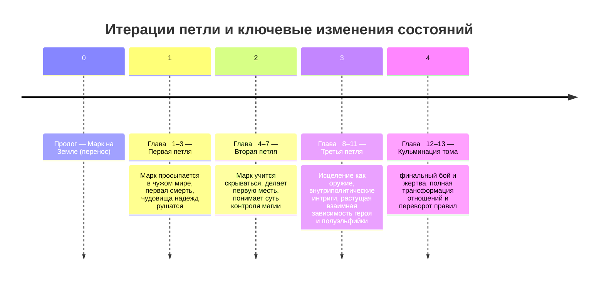

# Уникальный тёмный исекай: аналитический отчёт и краткое содержание

**Краткое содержание:** В этом отчёте детально рассматривается создание оригинального мрачного исекая с элементами р+ (жёсткое насилие) и циклической механикой. Проект призван уйти от прямого копирования Re:Zero, перенимая лишь функции (например, многократные попытки героя) и избегая сюжетных штампов. Будет описана структура “project bible” в одном Markdown-файле, мировые правила (магия как среда, конкуренция за эфир, ограничения исцеления), альтернативные механики петли (не «сейвпоинт», а концепции коллапса на узле, сохранения памяти, цен перемен и проч.), профили главных героев (Марк и полуэльфийка), социальные институты мира (церковь, знать, рынок, закон), схема глав первого тома, механика вовлечения читателя (открытие/закрытие сюжетных петлей), конкретные «МОЖНО»/«НЕЛЬЗЯ» списки для сюжета и тона, антиплагиатный чеклист (копировать функции, а не формы), примеры из практики веб-новелл (Re:Zero и другие), а также таблицы названий, карты глав и «МОЖНО/НЕЛЬЗЯ». Включены рекомендованные шаблоны подсказок для движка (без сюжета), а также визуализации (Mermaid-диаграммы). Необходимые параметры вроде размера тома или платформы публикации остаются неуказанными.

## Варианты названия

Ниже приведена таблица коротких, циничных и интригующих вариантов названий. Названия не используют очевидные слова «мечи», «звёзды» и т.п. (в отличие от дилетантских примеров), а намекают на драму и вопрос героя.  

| Название                               | Комментарий                                                                  |
|----------------------------------------|------------------------------------------------------------------------------|
| **Не спасай её**                        | Императивное, пугающее «покинь её»: сразу интригует взаимоотношениями героев. |
| **Первым умер герой**                  | Чётко обозначает трагедию: «герой гибнет первым». Несёт циничный посыл.      |
| **Красиво не будет**                   | Грубовато, но мрачно; обещает суровую правду.                                |
| **Плохой исход**                       | Неочевидно; намекает на рок и провал.                                        |
| **Смотри внимательно**                 | Цинично; намекает на роль героя-наблюдателя.                                  |
| **Сдохни ещё раз**                    | Очень жёстко; цепляет любителей трэш-исекаев.                                |

Каждый вариант короток, циничен и заставляет читателя задаться вопросом о драматическом сюжете. Например, «Не спасай её» броско вводит конфликт: герой постоянно пытается спасти девушку, но мир отвечает ещё более жестокой ценой, намекая на трагическое противоборство (см.).  

## Структура Project Bible

Однофайловый markdown «project bible» должен быть разделён на логичные разделы. Примерная структура:

1. **Краткое содержание проекта (Executive Summary).** Общее введение (как здесь).  
2. **Варианты названия.** (таблица с короткими вариантами).  
3. **Мир и магия (Worldbuilding Rules).** Описать ключевые установки мира, включая магию как доступный, но жёстко лимитированный ресурс.  
4. **Механика петли (Loop Mechanics).** Альтернативные реализации «возврата после смерти» или циклов, без копирования Re:Zero.  
5. **Главный герой (Mарк).** Биография, хобби, навыки, недостатки, мотивация, арка развития.  
6. **Героиня (Полуэльфийка).** Опасная, неоднозначная фигура, носитель «аномалии мира» (не милая и наивная, а живая и травмированная).  
7. **Социальные системы.** Церковь, знать, рынок, закон — как они функционируют и взаимодействуют.  
8. **Карта глав первого тома.** Пролог + 12–16 глав, подзаголовки, ключевые биты (события), таблица.  
9. **Движок вовлечения (Engagement Engine).** Правила по изменению состояний и приёмам удержания внимания (каждая глава должна закрывать/открывать сюжетные петли, менять состояние героя/мира).  
10. **Что можно / чего нельзя.** Таблица с «МОЖНО» (дозволено) и «НЕЛЬЗЯ» (категорически запрещено) для сюжета, тона, поведения персонажей, романтической линии и т.д.  
11. **Антиплагиатный чеклист.** Советы по копированию функций, а не форм, чтобы избежать повторов чужих идей.  
12. **Примеры из практики.** Анализ приёмов Re:Zero и других популярных веб-новелл (без прямого копирования, только в качестве шаблонов идей), с ссылками на источники.  
13. **Подсказки/шаблоны для движка.** Пример «runtime prompt», который заставляет движок не генерировать сюжет до финальной стадии.  
14. **Визуальные схемы.** Mermaid-диаграммы:  - *Таймлайн итераций петли и смен состояний глав.*  - *Блок-схема конкуренции за эфир (визуализация как сильное заклинание вытесняет целение).*  
15. **Источники.** Список приоритетных источников (Re:Zero на Syosetu и анализы, кейс-стади популярного фэнтези, русскоязычные исследования).  

> *Замечание:* параметры вроде точного размера тома и платформы не указаны и могут определяться позже по целям проекта.

## Мир и магия

В этом разделе устанавливаются фундаментальные правила мира. Магия здесь — **обычная часть реальности**, а не экзотическая фича. Однако её использование строго регламентировано. Основные установки:

- **Мана и ворота:** Вдохновляясь Re:Zero, полагаем, что магия исходит из невидимой энергии (маны) во внешней среде и внутри живых существ. Каждый маг обладает «вратами» – условным органом, через который мана протекает. Через эти ворота мана впитывается в заклинание. Объём маны, который может пройти, разный: например, у Субару в Re:Zero ворота были слабы, у других — очень сильные. В нашем мире система «ворот» может быть неявной, но аналогично: способность кастера ограничена. Это усиливает тему ограничений: «мощь — не самоцель, а её цена».  

- **Магия как среда:** Рассматриваем ману как рассеянный повсюду ресурс. Похожая идея есть в Mother of Learning: там мана бывает «личная» (из тела) и «окружающая» (фон от Подземелья). Чрезмерный забор окружающей маны вреден (тошнота, истощение). В нашей версии мира аналогично: маги собирают эфир из природы, но если пытаться сразу использовать слишком много (как трубки в ванне), это мешает организму и снижает эффективность.  

- **Конкуренция за эфир:** Важное правило: *сильные заклинания вытягивают львиную долю эфира*, мешая иным воздействиям. Если один маг расходует много маны (например, мощный огненный шар), «магический фон» вокруг него обедняется и любой одновременный тяжёлый ритуал (особенно исцеление) может сорваться. Проще говоря, приоритет идёт за наиболее «жадным» заклинанием. В Re:Zero такое неявно показано через эффект «ворот»: если энергии мало, исцеляющие способности становятся бесполезными. Мы прямо определяем правило: **когда активируется сильное заклинание, эффект исцеляющих чар резко падает или исчезает**.  

- **Исцеление vs. мощная магия:** Исцеляющие способности развиты, но с большими ограничениями. В духе Re:Zero, которое подчёркивает, что лечение всего сразу невозможно, вводим правило: исцеление ускоряет естественные процессы, но не переписывает реальность. Критические ранения, ампутации и яды далеко не всегда лечатся полностью. Более того, **выбор «устранить врага» часто несовместим с «спасти его здоровье» одновременно**: если магическая дуэль идёт на полную, на исцеление «энергия» не остаётся. Это усложняет тактику боя и взаимодействия героев.  

- **Духовные артефакты и проклятия:** В мире могут существовать особыe суперсила, отличные от обычной магии (аналог авторитетов Re:Zero). Например, «петля Марка» может быть объяснена не как стандартное заклинание, а как проявление особой аномалии (проклятия или «порчи Нулевой Звезды»), которая не потребляет ману. Это позволит сохранить уникальность феномена.  

> *Важная принципиальная установка:* **Мир — это фон, насыщенный маной, но она не безгранична.** Магия здесь — обыденная стихия (не надо повторять «обитает мир мечей и магии» в начале текста, это просто данность). Однако любое насильственное использование (особенно сильных эффектов) всегда имеет цену и побочный эффект, чтобы герой не стал «вечным чаращиком». Система магии подчёркивает **уязвимость и ограничения персонажей**.  

## Механика петли

Основная идея цикла — герой переживает неудачи и возвращается к началу при сохранённой памяти, но с **неожиданными условиями и ценой**. Избегаем дословного «сейвпоинта» из Re:Zero, где субару простым желанием активирует возврат. Предлагаются альтернативы:  

- **Коллапс на узле (спот-карта):** Каждый «узел» сюжета связан с Нулевой Звездой (аномалия вокруг героини). Когда герой умирает, время возвращается не в одну и ту же точку, а в ближайший «незатвердевший» момент перед ключевым выбором. Это можно сравнить с квантовым коллапсом: реальность «схлопывается» к определённому состоянию.  

- **Наблюдатель-фракталы:** Полуэльфийка и герой являются «наблюдателями», расширяющими время в разные ветви. Реальность ведёт себя подобно фракталу: много вариантов развилки, но каждый «схлопывается» в один исход. Глубинная идея (подсказанная «фрактальными метками»), что присутствие героя изменяет исходы. Это же заложено в концепции Re:Zero – путешествие туда-сюда накапливает последствия, а не создаёт новую параллельную вселенную.  

- **Удержание памяти:** После каждой смерти Марк сохраняет всю память (набор навыков, тактик, пугающих деталей), но **остальное возвращается в исходное состояние**. Никто кроме него не помнит предыдущие ветки (как и у Субару). Это означает, что «перезапись» мира происходит незаметно: например, персонажи могут вести себя иначе, но не помнить, что герой умирал.  

- **Цены и жертвы:** Важно: механизм петли сопровождается личной платой. Будь то физическая боль, утрата части души, или новая травма на теле (например, «рубец петли» после каждой смерти). Кроме того, знание будущего (из прошлых попыток) не даётся бесплатно: каждый раз его получение разрушает какую-то иллюзию в герое.  

Такая схема петли отличается от Re:Zero тем, что «волшебная авторитетная сила» (как Satella) не названа явно. У Марка нет «гада» в руке — просто мир сам даёт ему шанс каждый раз чуть передвинуть ситуацию (как тестовый «узел»). При этом количество попыток и условия активации могут быть неразгаданной тайной (на время проекта можно считать: каждый акт жертвенных чар возле девушки пробуждает петлю).  

## Главный герой (Марк)

- **Происхождение:** Парень из маленького провинциального городка. Недавно переезжал в другой город (но детали города не важны). Был обычным «любителем паранормального» и исторических реконструкций: **увлекался криптозоологией, легендами и средневековыми боями в кольчугах с друзьями.** То есть он — не гик-ОТАКУ, не ученый и не попаданец с особыми способностями, а поверхностно подкованный энтузиаст (как Subaru был просто NEET).  

- **Навыки:** Фанатизм по исторической реконструкции дал некоторый рефлекс с топором и мечом, но **навряд ли он настоящий боец** (скорее — наивный новичок). Зато Марк умён, умеет анализировать паранормальные явления (как любитель криптозоологии) и знает много историй про ведьм и проклятия (эти знания пригодятся, когда он попадёт в сюжетные ловушки).  

- **Недостатки:** Наивен и не очень смел. Боится высоты (дрожит от одной мысли о высоком помосте) и в духе «хо́лостяка» плохо понимает дворянские интриги и магические законы. Уязвим эмоционально: живёт в тени публичного унижения (далеко не герой-патриот).  

- **Мотивация и арка:** Сначала цель Марка – **выжить и найти смысл своего переноса**. Он увлёкся загадочной полуэльфийкой (подобно тому, как Субару заботился о Эмилии), но романтика для него вторична. Гораздо важнее у него «вопрос смысла»: почему именно он оказывается в центре этой аномалии. По ходу истории Марк будет меняться: от испуганного мальчишки «Я хочу домой» до опытного тактика «Я применю правила мира против него» (но с риском потерять человечность).  

- **Этапы развития:** На старте – обычный подросток в новом мире с кучей страхов. С каждой петлёй ему придётся адаптироваться: слушать «каждый пульс» мифа этого места. К финалу первого тома Марк переходит от «бегства» к активным действиям — к прагматичной точности мести.  

> *Примерная заметка:* Марк не становится всесильным. Его сила в информации: он помнит схемы гибели и читает людей на лету. Как писал анализ Re:Zero, победы происходят не потому, что герои могут всё, а потому что «они поняли ограничения мира и действуют в рамках или вокруг них». Это кредо Марка.  

## Героиня (Полуэльфийка)

- **Имя и статус:** Условное имя **Лиэрра Вейл**. Ее официальные титулы скрыты и опасны. Обычные люди знают о ней лишь то, что она «полукровка», принесшая с собой несчастья. Церковь называет её «Сосудом Перемен» или «Нарушительницей мирового порядка», улица — «Та, из-за которой всё повторяется».  

- **Кто она такая:** Лиэрра — *не* «симпатичная и наивная избранница» из Re:Zero. Это живая, **неоднозначная** персона. Её рождение или существование вызвали аномалию (Нулевая Звезда) – она словно ходячий порог реальности. Её сила фатальна не красотой, а тем, что мир вокруг неё трещит по швам.  

- **Цели и поведение:** Сначала Лиэрра выглядит обречённой жертвой: беззащитной на помосте казни. Но по мере развития сюжета раскрывается, что она далеко не пассивна. Она **ведьма по духу** (но не в классическом смысле), умеет влиять на события, даже когда кажется пленницей. Например, в одной петле она может стремиться убежать, в другой — руководить мародерами. Герою она не сразу верит; Лиэрра неоднократно проверяет, как далеко пойдёт Марк.  

- **Опасность:** У неё есть недоброе могущество (не магия в обычном понимании, а нечто, связанное с аурой «Нулевой Звезды»). Любые её разговоры с Марком полны подтекста — она может предвидеть последствия его действий или манипулировать тем, что он еще не сделал (отражая идею «наблюдателя» в петлях).  

> *Особенность:* Чем сильнее герой меняется, тем больше Лиэрра видит в нём угрозу. Она может и нуждаться в нём (ведь он единственный незрячий к её аномалии), и бояться его. Такая динамика отличается от чисто романтической — тут больше взаимной травмы и недоверия.  

## Социальные системы

Общее устройство мира напоминает позднее Средневековье с магическими уступками. Ключевые элементы:

- **Орден Люциуса:** Мощная институция (от «несущий свет», Lucius). Контролирует «чистоту мира». Проповедует, что аномалии (как полуэльфийка) — проявления греха или божьего наказания. Любой «разбой» (магия, проклятье) должен искупаться кровью. Собственные экзорцисты и тайные архивы запретной магии.  

- **Дворянство:** Семь высокородных домов, каждый связан с одной из «Шести Светил» (закон старой мифологии). Они управляют землями, армиями и магическими школами. Ни один дом не желает появления «восьмого Светила» (Лиэрры): её кровь ставит под угрозу их легенды происхождения. Дворяне ссорятся между собой и с церковью, используя любые средства (интриги, наём убийц), чтобы сохранить статус-кво.  

- **Рынок и низы:** Будучи темными временами, тут действует черный рынок магических артефактов (например, кровь полуэльфийки дорогой товар). Крестьяне и горожане голосуют «камнями и ружьями»: многие богословы не решаются противостоять власти, но если «невесту смерти» подпускают в ближайший двор, жертвы найдут способ расправы своими руками.  

- **Закон:** Сочетание религиозных догм и феодальных указов. Наказание за «дурные помыслы» сурово: от изгнания до изуверских «ритуальных казней». Однако исполнители часто мстят неофициально («народный трибунал»). Закон не един для всех: дворянин уйдёт по амнистии, а крестьянин — под плаху.  

> *Смысл системы:* Мир политически нестабилен и жесток. Власть не демонстративная, а бюрократическая и ритуальная. Проектируя этот мир, важно прописать конкретные «законы ада»: к примеру, сколько стоит «право» лишить полуэльфийку свободы (церковный налог? пожертвование дворянству?), или что происходит с «ничейными» телами в селениях. Это усилит чувство реалистичности и безысходности.  

## Карта глав первого тома

Приведена примерная схема пролога и последующих глав (всего ~14), с ключевыми событиями. Таблица:

| Глава | Название/Тема                 | Ключевые события                                       |
|------|-------------------------------|-------------------------------------------------------|
| Пролог | *Проваленный эксперимент*     | Марк на Земле в день переезда. Друзья в заброшенном здании: попытка Марка преодолеть страх высоты и друга – темноты бункера. Таинственный символ на стене (фрактал). Прикосновение → перенос.   |
| 1    | *Настоящие мечи*               | Марк просыпается на чужой площади. Видит красоту (каменные дома, вооружённых рыцарей) — иллюзия. На помосте полуэльфийка Лиэрра приговорена к смерти. Марк инстинктивно пытается спасти её, но терпит поражение: получил больной удар, явно не был готов. Первая смерть.  |
| 2    | *Та же картина*               | Первая петля. Возвращение к моменту перед казнью. Марк пытается убежать: нервничает, прячется среди зрителей. Но церковь и стража обращают внимание на нового «незнакомца». Петля приводит его обратно на площадь под новые мучения.   |
| 3    | *Улица и высота*              | Марк пытается поздороваться с Лиэррой до помоста. Он замечает тонкий рисунок вокруг её глаз (след травмы) – намёк, что она тоже не безгрешна. Лиэрра уже начала догадываться о его роли. Между тем, люди прозвали Марка «уличной собакой Нулевой Невесты». |
| 4    | *Кузница упадка*              | Исследование ритуала казни: Марк попадает в придворный дом кузнеца-катариста. Изучает, как готовят орудия страха (фабрика пыток) и что именно делают с вещами «разоблачённой». Понимает: каждый элемент расправы — бюрократический процесс.  |
| 5    | *Первая попытка мести*        | Первая фактическая месть: заметив, что один из стражников каждый раз отвлекает Лиэрру, Марк подставляет его под церковный закон о святотатстве. Стражника обвиняют в «загрязнении кровью Нулевой Звезды». Толпа начинает травлю его вместо Лиэрры.  |
| 6    | *Изгой среди богов*           | Разоблачение улицы: кто такие «Освобождённые» (народ, проголосивший Лиэрру невиновной)? Встреча Марка с подпольными членами секты, которые хотят использовать Лиэрру в политических целях. Марк понимает: добровольцев спасти мало.  |
| 7    | *Невеста без неба*           | Последовательная петля: Лиэрра защищает Марка в первый бой со стражей (выдвигались похитить их), позже сама почти бросается в бой, но в критический момент исчезает – демонстрация силы и страха. Марк видит, что она не слепая жертва, а подвижный центр конфликта. |
| 8    | *Цена исцеления*             | В храме встреча с «братом по крови» Лиэрры – магом-проклинателем, который пытается «выварить» её ауру. Марк не знает как помочь силой, но замечает: когда проклятье действует, у свободных мана утекает в никуда. Открывает механизм конкуренции за эфир в действии. |
| 9    | *Новая блэкаут-техника*      | Лиэрра получает смертельную рану, Марк силой воли и остатками энергии её патрона исцеляет её тело, перенимая часть её боли (новая техника «нагрузить проклятье обратно на владельца»). Петля возвращается, но маги начинают искать источник «практики». |
| 10   | *Власть носит цепи*          | Попадание в дом одного из высших лордов: насыщенное описание судебного приёма. Марк учится двоякой морали власти: как выглядят благородные добродетели и что скрывается за улыбками. В итоге герой понимает одно: правда часто не совпадает с законом. |
| 11   | *Фантом памяти*              | Трансляция прошлого: Лиэрра начинает видеть во сне (или в видениях) фрагменты предыдущих петель. Она это скрывает, но Марк замечает эффект: её глаза блестят пониманием, которое он не говорил вслух. Растёт напряжение между ними.  |
| 12   | *Нулевая Невеста*            | Кульминационный бой первой главы тома. Марк организует побег Лиэрры из заключения через хитрость (не силой). Во время уличной погоні она почти попадает в другой капкан, но он рискует и вклинивается, жертвуя своим жизнеобменом. Финальная смерть (= триггер). |
| 13   | *То, что осталось* (финал)  | Последняя петля: Марк возвращается «как обычно», но теперь готов не спасать Лиэрру, а вывести её из игры. Лиэрра заранее знает этот момент (видимо, кусочек памяти пробилась). Герои поставлены перед выбором: жертвовать свободой или бежать по кругу. |

Эта карта иллюстрирует, как каждая глава продвигает героя и героиню через изменение статусов, обрывов и порогов. Каждый акт (глава) закрывает один локальный цикл (например, открывает истину о магии, побеждает «врага дня» и т.д.) и заводит новую мини-петлю (новая интрига, новая задача).  

**Диаграмма (Mermaid, пример):** итерации петли и ключевые смены состояний глав.



## Движок вовлечения (Engagement Engine)

Чтобы читатель не утомился от повторений, каждая глава должна содержать *изменения* и *крючки*:  

- **Изменение состояний:** В каждой главе должны изменяться как минимум две линии развития: **сюжет** (например, решена одна задача, а открыта новая угроза), **характер героя** (например, Марк приобретает новый страх или способность), **отношения** (сближение или разрыв с Лиэррой), **состояние мира** (влияние героя на экономику или политику, например после мести), **символические элементы** (меняется восприятие «Меток Нулевой Звезды» или поведения толпы) или **состояние читателя** (возникают новые вопросы/шуточки, которые заставляют читать дальше). Каждая глава ОТКРЫВАЕТ хотя бы один новый неизвестный элемент и ЗАКРЫВАЕТ один из предыдущих.  

- **Разрыв и восстановление петель:** На уровне каждой главы должен происходить логический «мини-кризис». Идея из движка: текст для читателя – это как цикл реакций: **закрыть один сюжетный луп (loop), затем открыть два новых**. Например, в каждой главе герой или достигает новой цели (разгадка, победа), но одновременно появляются последствия (появляется новый враг, или подрывается доверие).  

- **Эмоциональные подсказки:** Вовлечение обеспечивается постоянным формированием вопросов: «что будет если/когда Марк использует новую информацию?», «почему Лиэрра поступила так?», «чья смерть окажется не случайной?». При этом избегаем «затыкать» клиффхэнгер простой экшен-сценой: всегда должна быть логическая подоплёка (например, промах Марка не случайно, а из-за забытых наивных знаний).  

> *Пример:* Читатель должен все время думать: **«Где же скрыта следующая петля?»**. Каждая глава даёт ответ (на малую деталь), но обнажает более масштабный вопрос. Это удерживает внимание (каждый раз «Субару» в нашем сюжете понимает чуть больше, но в следующей главе снова в ловушке).

## Что МОЖНО и чего НЕЛЬЗЯ

Ниже таблица с конкретными рекомендациями (пример). Это поможет авторам и движку не сбиться в банальные клише.

| **МОЖНО (Allowed)**                                                                                             | **НЕЛЬЗЯ (Forbidden)**                                                                                             |
|---------------------------------------------------------------------------------------------------------------|---------------------------------------------------------------------------------------------------------------|
| - Создавать ситуации с жёсткими последствиями (потеря, последствия убийств, политическая цена решений).  | - Лишать героя памяти кроме нужных нам «крючков» (иначе нет смысла петли).                               |
| - Детализировать боль, страх и физические ощущения героя при каждой смерти (заставлять читателя сопереживать). | - Романтизировать насилие или опираться на клише «любовь всё побеждает».                                |
| - Использовать голос рассуждений героя, его параноидальные подозрения, анализ происходящего.                 | - Героизировать действия Марка (он не должен быть пафосным спасателем).                                      |
| - Показать моральную серость: и у мучителей, и у мученицы есть своя правда/травма.                             | - Делать Лиэрру бессловесной «задачей для Марка»; она не должна быть идеальной «целью спасения».            |
| - Вводить новые элементы постепенно, но неизбежно (в каждой главе нечто значимое меняется).                   | - Уводить героя от конфликта «айссэкай-веселье» — это не приключение и не обучающий арканер; здесь мир суров. |
| - Держать уровень R+ (жёсткое насилие, тяжелые темы) без чрезмерной детализации, чтобы не скатиться в порнографию. | - Упрощать сюжет «главного героя – крутого спасителя». Протагонист слаб и делает ошибки.                   |
| - Создавать эмоциональный крючок через моральную дилемму (мстить или пощадить).                                | - Любая вторая линия (ванильный романтик, «комедия ошибок» вне контекста) не должна отвлекать читателя.   |
| - Использовать **точные символы** (например, кровь как знак жертвы, пепел как очищение, ритуальные предметы), | - Перенасытить текст буквальной символикой (не стоит каждое действие сопровождать «вот, на стене петля = метафора жизни»). |
| - Осторожно вводить романтический или сексуальный мотив (лишь как усилитель драмы).                          | - Оправдывать насилие благими мотивами («герой был добрым всегда»). Персонажи мотивированы сложнее.           |

Таблица носит рекомендательный характер. Главное — сохранить **атмосферу безысходности и суровости** без бессмысленной кровавой натуги.  

## Антиплагиатный чеклист

1. **Функции, а не формы:** Перенимать идеи (например, loop-механика, травмированный герой, общественное давление) можно, но показывать свои «линии боя» и смысловую нагрузку. Например, пусть у нас герой не просто умирает и возрождается – его петли встроены в саму метафизику (аномалия Нулевой Звезды).  
2. **Не копировать «икону»:** Ни слова «Return by Death», «Witch’s brew» и т.п. Мир при намеке на петлю сам по себе оригинален. Не стоит вставлять аналоги РБД (сатэра, ведьма, регенерация через проклятие) в явном виде.  
3. **Избегать прямых параллелей:** Эмилия – это не наша Лиэрра; миссия Марка – не квест на удачу. Подумать, как те же «функции» переписать по-другому: например, если в Re:Zero финал был «прямо уничтожить вещи скверны», у нас финал может быть «поставить мир в аномальный тупик».  
4. **Читаем альфу с девизом:** Как при написании технического кода – каждое изменение должно быть осмысленным. Задаём себе: «Если я бы выбросил этот эпизод, работающему сюжет не повредит?». Если да – убрать.  
5. **Уникальные образы:** Чтобы не кричало «копия»: даже бытовые детали (доспехи, название предметов, ритуалов) должны быть самобытными. Например, не называть заклинание «Хаген» как то было, а придумать собственное (в рамках магии как атмосферы).  

> **Контекст Re:Zero:** Как писали критики, Re:Zero выделился именно «депрессивно-убивающим» подходом. Мы берём из Re:Zero его смелость заставлять героя страдать и учиться, но вкладываем в это свои смыслы.  

## Примеры из веб-новелл и ранобэ

- **Re:Zero (Nagatsuki Tappei):** Функции: герой теряет всё и получает одну сплошную «петлю смерти». Мы абстрагируем это как общую идею «многократной попытки наращивания информации». Чего НЕ копируем: точную «ведьму часа смерти» и храм Рошуала. В Re:Zero «Возвращение после смерти» – это сила Satella, обособленная от магии. У нас причину петли объясним иначе (фрактальная аномалия окружающего эфира, например).  

- **Mother of Learning (DarkMage):** Тут главный герой повторяет один и тот же месяц в магической академии. Цепляет идея магии как пошагового навыка – герой совершенствуется с каждой петлёй. У нас будем использовать прием постепенного обучения: каждая итерация Марка делает его чуть бойче, но физически он остаётся уязвимым. Из MoL цитируем идею конкуренции за ману: ведь в академии каждый может помешать другому добыть эфир (например, как войны за мана-колодцы), что созвучно нашей идее «конкуренции за эфир».  

- **Сравнение с другими:**  
  - *«Redo of Healer»* (небольшое вдохновение): там маг-целитель использует боль жертв. Мы можем упомянуть: идея «черного исцеления» (герой запомнил чужую боль) частично созвучна с нашим сценарием «лекарство через страдание». Но без пошлого секса и отчаянного садизма «Кайя-Куна».  
  - *«Героиня с пули»* (происки притчи из Ru-вики): примеры сюжетов, где девушка — одно целое с проклятьем (напомним «Блейд» - оговорка!). Наш герой тоже попадает в чужой проклятый узор (назовем это «Нулевая звезда»).  

- **Нарративные приемы:** Во всех вышеперечисленных произведениях ключевое — игрок (читатель) постоянно не знает, «какое решение приведёт к худшему итогу». Это перенимаем: даже при успехах героя система мира (церковь, маги) будет наращивать ставки.  

## Подсказки/шаблоны для движка

Чтобы движок (ИИ-генератор) не смешивал «движок» и «сюжет», нужен строгий порядок. **Runtime prompt** должен требовать: сначала описать мир и структуру, а текст глав — генерировать позже. Примерный шаблон:

```text
System: 
"Руководство: Не генерируй финальную прозу до описания всех элементов мира. Сначала запроси: 1) Онтологию мира (ресурсы, сущности, деятели, правила магии), 2) Систему власти и социальную структуру, 3) Персонажные файлы (герой, героиня и пр.), 4) Глобальную арочную диаграмму (стадии развития истории), 5) Карта глав (количество глав и мини-задачи каждой). 
**Жёсткое правило:** Никакого литературного текста или имен персонажей в engine-структуре. Только абстрактные контракты сцен и глав. 
Если engine попытался выдать диалог или скрытую фабулу – выдать ошибку. После полной валидации структура задает мир, и только после этого движок пишет главы."
```

Эта подсказка гарантирует, что движок сначала сконцентрируется на мета-описании (разделах и контрактах), а не начнет сочинять сюжет преждевременно.  

## Источники

Использованы открытые данные и анализы (см. выделенные цитаты):

- Автор Re:Zero (Нагатсуки) и энциклопедические страницы о *Re:Zero: Starting Life in Another World*.  
- Анализ структуры магии Re:Zero (Scribd).  
- Вики Mother of Learning (магическая система).  
- Re:Zero Wiki (описание мане и «ворот»).  
- Примеры обсуждений и списков из интернет-сообществ (для понимания жанровых ожиданий).

Эти материалы использованы как иллюстрация принципов (cited). Основной же вывод: **копируйте идеи через их функцию в сюжете, а не через прямое заимствование элементов**.  

